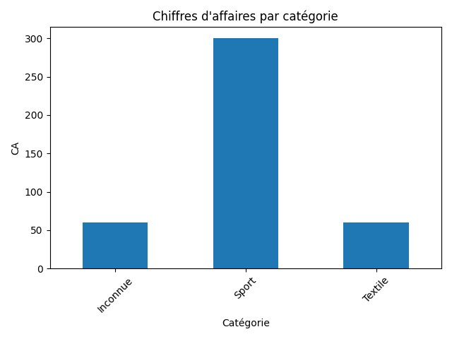
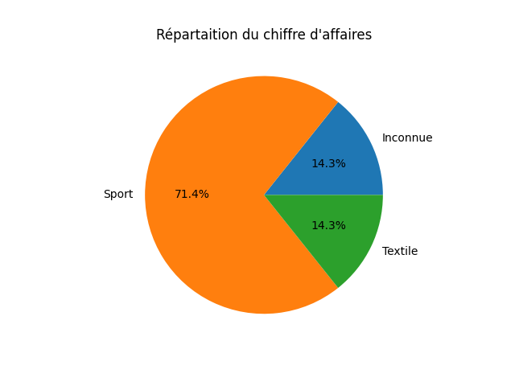
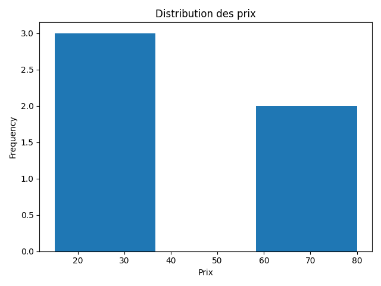

# 📊 Analyse des ventes avec Python

Projet réalisé dans le cadre de mon apprentissage en data analyse.

## 🎯 Objectif
Analyser un dataset de ventes pour extraire des informations clés :
- Chiffre d'affaires total
- Produit le plus vendu
- Catégorie la plus performante

## 🛠️ Technologies utilisées
- Python
- Pandas
- Matplotlib

## 📁 Structure du projet
- `data/` : fichiers CSV
- `scripts/` : scripts Python
- `graphs/` : graphiques générés

## 📊 Résultats

### Chiffre d'affaires par catégorie


### Répartition du CA


### Distribution des prix


## 🚀 Lancer le projet

```bash
py -3.12 scripts/analyse_ventes_clean.py
```

Projet réalisé par Ait-Alia Melvin